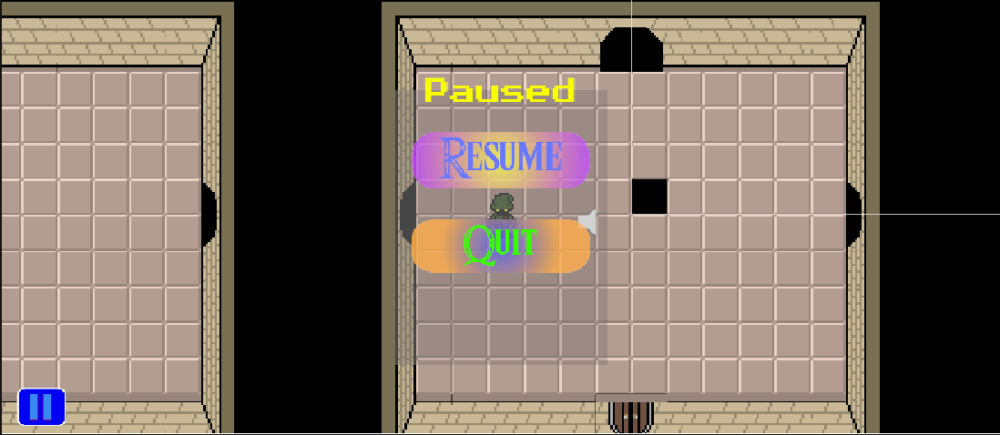
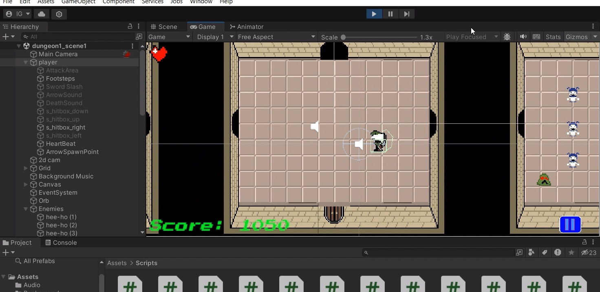
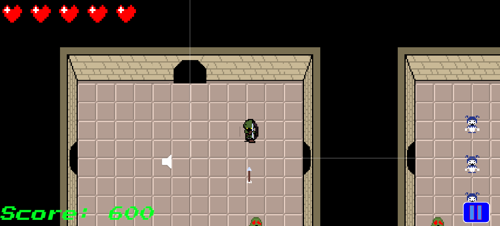
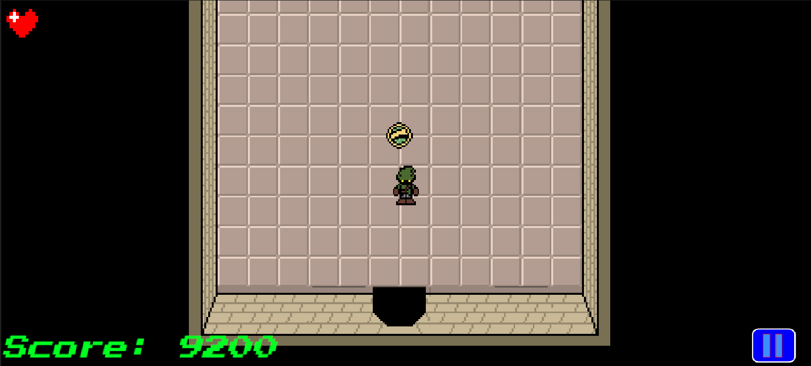

# Project Not Zelda

> A Unity gameplay programming prototype demonstrating level design, game systems and game AI

[]()
[]()
[]()

## 📖 Overview

Project Not Zelda is a 2D action-adventure game that explores 2D game design and implementation. At the time of project conception, I was playing The Legend Of Zelda on NES and found the classic very intriguing in various aspects of its game design. This fascination for classic NES title enabled me to pitch a small Unity demo with the elements from The Legend of Zelda. The goal of the project was to create a working demo that demonstrated fundamentals in working in Unity, and understanding game programming; as well as game design. 

## 👥 Team & Contributions

### My Role: Lead Gameplay Programmer & Level Designer

I was responsible for designing and implementing several of the core
systems that drive the game's moment-to-moment gameplay.

I developed 8 gameplay systems in Unity using C#:

- Player Movement
- Player Attack
- Player Damage
- Hit Points
- Pause / Play / Game Over
- Enemy AI
- Enemy Damage
- Score Management

I also contributed to level design and collaborated with teammates on
combat and player health functionality.

### Team Contributions
- **Austin Hoang:** Character and dungeon art, animations, and collaboration on C# scripts
- **Isaac Akhtar Zada ​:** Collaborated on player combat functionality
- **Kyle Frederick:** Collaborated on the player health system

### Key Features

- Player Movement
- Player Combat
- Score Manager
- Player Life Management

---

## 🎮 Gameplay

In Project Not Zelda, the player uses WASD the move the player character in their desired direction. The player is to defeat enemies in the dungeon with the use of a sword [space bar] and a bow and arrow [Right Shift]. The goal of the game is to reach the end of the dungeon to obtain a special item to save the in-game world.

### Controls

| Action | Keyboard |
|---|---|
| Move | WASD |
| Primary Attack | Space |
| Secondary Attack | Left Shift |

---

## 🛠️ Technical Implementation

### Player Movement & Attack

The player controller was implemented using Unity's 2D physics
and collision systems to handle movement and interactions with
the environment.

- Used Rigidbody2D-based movement to control player navigation.
- Implemented directional attacks based on the player's facing direction.
- Used collision detection to determine interactions between attacks,
  enemies, and environmental objects.
- Integrated the attack system with player animation and damage logic.

### Enemy AI

The enemy AI was implemented using Vector2 and Vector3's transform 
functions to handle 2 distinct enemy behaviors.  

- Used Vector2 to transform the enemy's movement.
- Implemented random transformations for unpredicatable enemy movement for 
enemies using Vector2.
- Used Vector3 to chase the player based on the player's current position.
- Integrated the Vector3 enemies with distance detection to determine when 
to chase the player.

### Score/Health Manager

The score/health manager was implemented with Unity's event system 
to handle updates per frame in relative to the player's in-game actions. 

- Used PlayerPrefs to set tags and integers for the score manager; while
arrays were used to represent the number of hearts the player has 
- Implemented player progression loop based on the player's skill level  
- Used collision based on when the player takes damage or defeats an enemy to
communicate with the manager
- Integrated score/health manager with visual feedback to the player

---

## 🧩 Challenges & Solutions

### Challenge 1 — GitHub Commit Issues

**Problem:**  
One of the biggest challenges during development was managing GitHub. The use of GitHub was either new to a lot of us or experience was very minimal. This caused a lot of confusion surrounding commits, add/deleted assets and various conflicts in the source files.

**Solution:**  
To mitigate the issues, we communicated more often about the changes being made before committing and pushing to the repository. For example, in class we would meet up and spend a few minutes going over the changes we made in the project. 

**Result:**  
After adopting this workflow, my team and I managed to work diligently and effectively throughout the remainder of development. We were also able to become more deliberate in how we communicated to each other to prevent potential issues in our repository space.  

---

### Challenge 2 — Teaching Unity

**Problem:**  
As the lead programmer, I was in charge of programming and directing the various systems for our game. In addition, I was also responsible for helping teammates who had less experience with Unity/C#.


**Solution:**  
To direct and teach my teammates, I used class time as an opportunity to discuss the inner workings of Unity and how to program in C#; while also leaving notes and comments within lines in the script. Additionally, to improve my scripting abilities, I looked into a lot of documentation on the official Unity page and designed multiple algorithms around the 2D vector. 

**Result:**  
After the team gained a better understanding of Unity, we were able to assist each other in several tasks without being concerned about the minimal experience with Unity. Resulting in greater collaboration and work ethic, in our efforts to manage/develop the project.


## 🚀 What I Learned

- During development of Project-Not-Zelda, I learned about effective and intentional documentation throughout program files. The use of comments throughout code helped not only me, but my team members understand portions of code and enabled questions amongst the group. This was a very valuable lesson to me because it taught me that a good programmer/engineer isn't exceptional if they aren't able to communicate what they did in a program to others in a readable form. 
- Another lesson I learned from this project was usage of GitHub. GitHub was a platform that I didn't have too much experience utilizing at the time of the project. However, through the loss of some code and commits, I soon learned the importance of maintaining a clean repository and communicating changes within program files effectively to prevent the loss of work and confusion amongst team members. 
- Lastly, I learned how to program compelling game mechanics and design in a 2D perspective. This was my first time developing in a 2D perspective in the Unity engine and I didn't play too many 2D games throughout my life. However, I wanted to contribute to making the best project possible, which enabled me to study how 2D games are designed through playing The Legend of Zelda on NES. This helped me get a better understanding of what made 2D games fun and compelling for their target audiences and allowed me to hone in on those elements.    

---

## 🔮 Future Improvements

- One of the improvements I'd make to Project Not Zelda is the inclusion of dungeon puzzles. Puzzles are an integral element in The Legend of Zelda series and we weren't able to incorporate that aspect into our demo due to time constraints. However, we'd like to incorporate this by multiple creating scripts for specific puzzles in the dungeon. We'd love to revisit this project with the mindset of expanding upon what we already built with meaningful additions, and this one we think would put a smile on player's faces. 
- In a future iteration, the bow and arrow program file would be polished significantly. The reason for this is that the initial implementation of the bow and arrow is functional, but not polished. As the arrow shoots from the bottom and the animation for the player chracter does not point in the correct direction when the bow and arrow is shot. This is integral to fix in the future because we want the players to be immersed in the experience. And if the player character isn't pointing the right direction when shots are fired or the arrow isn't going in the right direction, the player may become disconnected to the overall experience. 
- Lastly, the current demo targets 30 FPS. A future iteration would profile CPU, GPU, physics, rendering, and garbage-collection performance using Unity's Profiler before determining which systems require optimization. The goal would be to achieve a smoother and more responsive experience at higher frame rates.

---

## 🎥 Gameplay / Demo

**Itch.io Demo:** https://ishmael-kwayisi.itch.io/project-not-zelda

**Video Demo:** [Mini Gameplay Demo](Screenshots/Project-Not-Zelda-Arrow-Combat.mp4)

---

## 📸 Screenshots

### [Pause Game]



### [Player combat]



### [Player Combat Arrow]



### [Endgame]



---

## 💻 Technologies

- Unity
- C#
- Visual Studio
- GitHub
- Aesprite
- Pixlr

---

## 📁 Project Structure

```text
[Project-Not-Zelda-it145]/
├── [Assets]/
│   ├── [Audio]/
│   ├── [Backgrounds]/
│   ├── [Fonts]/
│   |       ├── [Press_Start_2P]
│   ├── [Inputs]/
│   ├── [Scenes]/
│   |      ├── [SceneAnimations]
│   ├── [Scripts]/
│   ├── [Sprites]/
│   ├── [TextMesh Pro]/
│   |      ├── [Documentation]
│   |      ├── [Fonts]
│   |      ├── [Resources]
│   |      ├── [Shaders]
│   └── [sprites]
├── [Packages]/
├── [ProjectSettigs]/
├── [Sprites]/
├── [Screenshots]/
└── README.md
```

## 📝 Documentation

This README was authored and is maintained by Ishmael Kwayisi to
document the project's development, technical implementation, and
team contributions.

The game itself was developed collaboratively by the team members
listed above.
